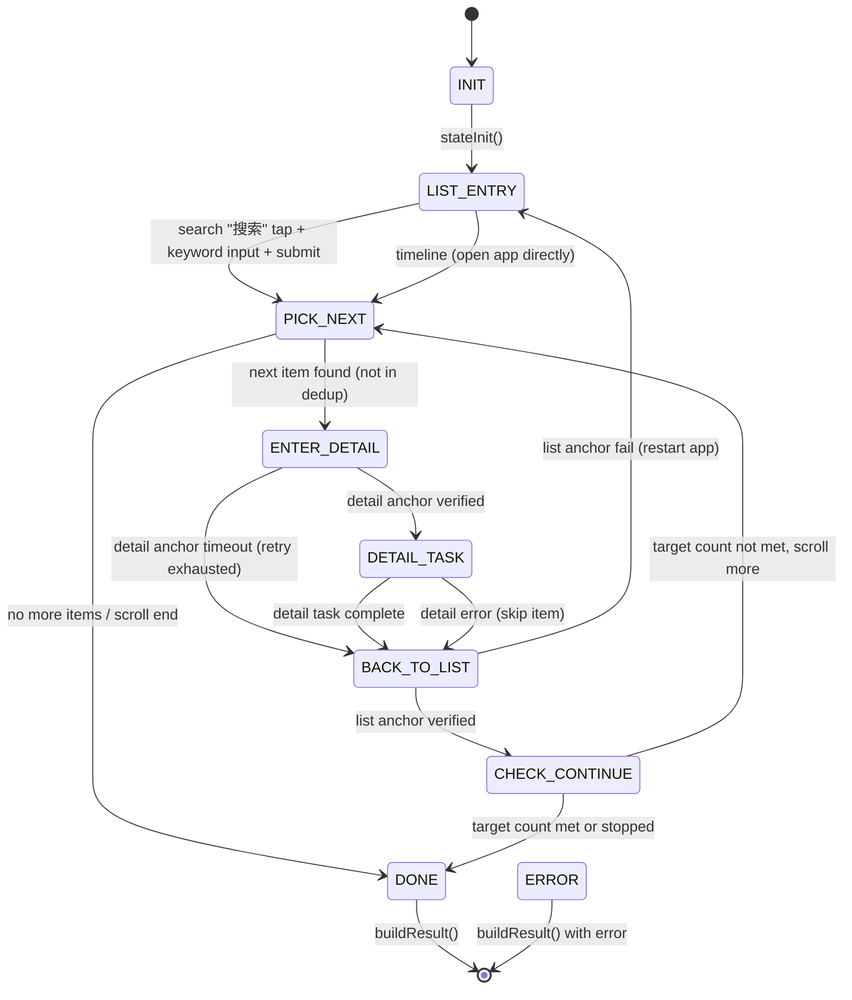
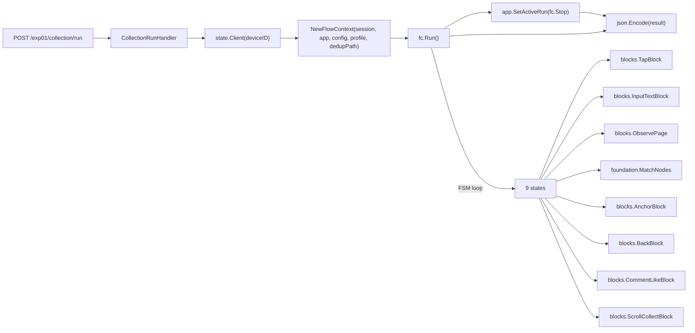

# Collection Flow State Machine — Mainline Source

> Auto-generated reference for 9-state FSM.
> Source: `services/mac-daemon/src/flows/collection_flow.go`

## State Diagram

## State transition funcs

| State | Method | Lines | Calls |
|-------|--------|-------|-------|
| INIT | `stateInit()` | 148-153 | checkpoint check |
| LIST_ENTRY | `stateListEntry()` | 155-212 | search or timeline |
| PICK_NEXT | `statePickNext()` | 225-259 | ObservePage, MatchNodes, SelectTargets |
| ENTER_DETAIL | `stateEnterDetail()` | 260-303 | TapBlock, AnchorBlock |
| DETAIL_TASK | `stateDetailTask()` | 305-338 | ObservePage, CommentLikeBlock |
| BACK_TO_LIST | `stateBackToList()` | 339-369 | BackBlock, AnchorBlock |
| CHECK_CONTINUE | `stateCheckContinue()` | 360-370 | check target count + scroll |
| DONE | `buildResult()` | 450-473 | finalize |
| ERROR | `buildResult()` | (from main loop) | finalize with error |

## Main call chain (collection flow)

## Resource limits

| Item | Value |
|------|-------|
| Max iterations | targetCount * 5 + 20 |
| Detail timeout | 120s (default) or config.DetailTimeoutMs |
| Run timeout | config.RunTimeoutMs (0 = no limit) |
| Peer detail retries | config.DetailMaxRetries (default in profile) |
| File size | 485 lines (near 500 cap) |

## Verification gates

| Gate | Command | Required before close |
|------|---------|---------------------|
| Go unit tests | `go test ./services/mac-daemon/...` | always |
| 500-line check | `./scripts/verify/check-file-lines.sh` | always |
| L4 device E2E | manual adb + device | **required** before claiming done |
