<!-- AUTO-GENERATE PLAN: sync from docs/architecture/mainline-call-map.yml + docs/architecture/function-map.yml -->
# Flowy Mainline Call Graph

Source of truth:
- `docs/architecture/mainline-call-map.yml` defines request/response/error edges
- `docs/architecture/function-map.yml` enriches owner summary and owner module context

Render rules:
- Mermaid diagram is a render artifact, not a second architecture truth source.
- `anchored` = verified caller/callee binding
- `binding pending` = edge intentionally left unresolved until code audit pins real bridge

---

## 1. Dispatcher Mainline

HTTP POST /exp01/command → Mac daemon → Android device via WebSocket

```mermaid
flowchart LR
  HttpReq01DispatchRequest["HttpReq01DispatchRequest"]
  FlowyReq01CommandEnvelopeBuilt["FlowyReq01CommandEnvelopeBuilt"]
  FlowyReq02SessionResolved["FlowyReq02SessionResolved"]
  FlowyReq03PendingRegistered["FlowyReq03PendingRegistered"]
  FlowyReq04WsCommandSent["FlowyReq04WsCommandSent"]
  FlowyReq05DeviceResponseReceived["FlowyReq05DeviceResponseReceived"]
  FlowyReq06RunFinalized["FlowyReq06RunFinalized"]
  HttpResp01DispatchResponse["HttpResp01DispatchResponse"]

  HttpReq01DispatchRequest -->|dispatch-00| FlowyReq01CommandEnvelopeBuilt
  FlowyReq01CommandEnvelopeBuilt -->|dispatch-01| FlowyReq02SessionResolved
  FlowyReq02SessionResolved -->|dispatch-02| FlowyReq03PendingRegistered
  FlowyReq03PendingRegistered -->|dispatch-03| FlowyReq04WsCommandSent
  FlowyReq04WsCommandSent -->|dispatch-04| FlowyReq05DeviceResponseReceived
  FlowyReq05DeviceResponseReceived -->|dispatch-05| FlowyReq06RunFinalized
  FlowyReq06RunFinalized -->|dispatch-06| HttpResp01DispatchResponse

  classDef anchored fill:#edf7ed,stroke:#2e7d32,stroke-width:1px,color:#1b1f23;
  classDef pending fill:#f4f4f5,stroke:#6b7280,stroke-width:1px,stroke-dasharray:5 5,color:#1b1f23;
  class HttpReq01DispatchRequest anchored;
  class FlowyReq01CommandEnvelopeBuilt anchored;
  class FlowyReq02SessionResolved anchored;
  class FlowyReq03PendingRegistered anchored;
  class FlowyReq04WsCommandSent anchored;
  class FlowyReq05DeviceResponseReceived anchored;
  class FlowyReq06RunFinalized anchored;
  class HttpResp01DispatchResponse anchored;
```

| step | transition | status | caller -> callee | owner |
|------|-----------|--------|-----------------|-------|
| dispatch-00 | HttpReq01DispatchRequest → FlowyReq01CommandEnvelopeBuilt | anchored | `command_roundtrip_flow.go:CommandRoundtripHandler` → `foundation.NewRequestID + foundation.NewRunID` | `feature.command_dispatch` |
| dispatch-01 | FlowyReq01CommandEnvelopeBuilt → FlowyReq02SessionResolved | anchored | `CommandRoundtripHandler` → `app.Client(deviceID)` | `state.app_management` |
| dispatch-02 | FlowyReq02SessionResolved → FlowyReq03PendingRegistered | anchored | `CommandRoundtripHandler` → `app.RegisterPending(requestID)` | `state.app_management` |
| dispatch-03 | FlowyReq03PendingRegistered → FlowyReq04WsCommandSent | anchored | `blocks/send_command.go:SendCommand` → `conn.WriteJSON` | `blocks.send_command` |
| dispatch-04 | FlowyReq04WsCommandSent → FlowyReq05DeviceResponseReceived | anchored | `flows/client_session_flow.go:RunClientSession` → `app.ResolvePending(response)` | `flows.client_session` |
| dispatch-05 | FlowyReq05DeviceResponseReceived → FlowyReq06RunFinalized | anchored | `flows/finalize_run_flow.go:FinalizeRun` → `blocks.PersistManifest + PersistResponse` | `blocks.persist` |
| dispatch-06 | FlowyReq06RunFinalized → HttpResp01DispatchResponse | anchored | `CommandRoundtripHandler` → `http.ResponseWriter` | `feature.command_dispatch` |

---

## 2. Collection Flow Mainline

HTTP POST /exp01/collection/run → 9-state FSM → per-item collect → back to list

```mermaid
flowchart LR
  HttpReq02CollectionRequest["HttpReq02CollectionRequest"]
  FlowyColl01FlowContextInitialized["FlowyColl01FlowContextInitialized"]
  FlowyColl02StateInitExecuted["FlowyColl02StateInitExecuted"]
  FlowyColl03ListEntryReady["FlowyColl03ListEntryReady"]
  FlowyColl04ItemPicked["FlowyColl04ItemPicked"]
  FlowyColl05EnterDetailExecuted["FlowyColl05EnterDetailExecuted"]
  FlowyColl06DetailTaskExecuted["FlowyColl06DetailTaskExecuted"]
  FlowyColl07BackToListExecuted["FlowyColl07BackToListExecuted"]
  FlowyColl08ContinueChecked["FlowyColl08ContinueChecked"]
  FlowyColl09ResultBuilt["FlowyColl09ResultBuilt"]
  HttpResp02CollectionResult["HttpResp02CollectionResult"]

  HttpReq02CollectionRequest -->|coll-00| FlowyColl01FlowContextInitialized
  FlowyColl01FlowContextInitialized -->|coll-01| FlowyColl02StateInitExecuted
  FlowyColl02StateInitExecuted -->|coll-02| FlowyColl03ListEntryReady
  FlowyColl03ListEntryReady -->|coll-03| FlowyColl04ItemPicked
  FlowyColl04ItemPicked -->|coll-04| FlowyColl05EnterDetailExecuted
  FlowyColl05EnterDetailExecuted -->|coll-05| FlowyColl06DetailTaskExecuted
  FlowyColl06DetailTaskExecuted -->|coll-06| FlowyColl07BackToListExecuted
  FlowyColl07BackToListExecuted -->|coll-07| FlowyColl08ContinueChecked
  FlowyColl08ContinueChecked -->|coll-08| FlowyColl09ResultBuilt
  FlowyColl09ResultBuilt -->|coll-09| HttpResp02CollectionResult

  classDef anchored fill:#edf7ed,stroke:#2e7d32,stroke-width:1px,color:#1b1f23;
  class HttpReq02CollectionRequest anchored;
  class FlowyColl01FlowContextInitialized anchored;
  class FlowyColl02StateInitExecuted anchored;
  class FlowyColl03ListEntryReady anchored;
  class FlowyColl04ItemPicked anchored;
  class FlowyColl05EnterDetailExecuted anchored;
  class FlowyColl06DetailTaskExecuted anchored;
  class FlowyColl07BackToListExecuted anchored;
  class FlowyColl08ContinueChecked anchored;
  class FlowyColl09ResultBuilt anchored;
  class HttpResp02CollectionResult anchored;
```

| step | transition | status | caller -> callee | owner |
|------|-----------|--------|-----------------|-------|
| coll-00 | HttpReq02CollectionRequest → FlowyColl01FlowContextInitialized | anchored | `collection_run_handler.go:CollectionRunHandler` → `NewFlowContext + foundation.LoadDedupStore` | `flows.collection` |
| coll-01 | FlowyColl01FlowContextInitialized → FlowyColl02StateInitExecuted | anchored | `FlowContext.Run` → `fc.stateInit()` | `flows.collection` |
| coll-02 | FlowyColl02StateInitExecuted → FlowyColl03ListEntryReady | anchored | `stateListEntrySearch/Timeline` → `blocks.TapBlock + InputTextBlock + ObservePage` | `flows.collection` |
| coll-03 | FlowyColl03ListEntryReady → FlowyColl04ItemPicked | anchored | `statePickNext` → `foundation.MatchNodes + SelectTargets` | `flows.collection` |
| coll-04 | FlowyColl04ItemPicked → FlowyColl05EnterDetailExecuted | anchored | `stateEnterDetail` → `blocks.TapBlock + AnchorBlock` | `flows.collection` |
| coll-05 | FlowyColl05EnterDetailExecuted → FlowyColl06DetailTaskExecuted | anchored | `stateDetailTask` → `ObservePage + MatchNodes + CommentLikeBlock` | `flows.collection` |
| coll-06 | FlowyColl06DetailTaskExecuted → FlowyColl07BackToListExecuted | anchored | `stateBackToList` → `blocks.BackBlock + AnchorBlock` | `flows.collection` |
| coll-07 | FlowyColl07BackToListExecuted → FlowyColl08ContinueChecked | anchored | `stateCheckContinue` → `in-process count vs TargetCount` | `flows.collection` |
| coll-08 | FlowyColl08ContinueChecked → FlowyColl09ResultBuilt | anchored | `buildResult` → `in-process aggregation` | `flows.collection` |
| coll-09 | FlowyColl09ResultBuilt → HttpResp02CollectionResult | anchored | `CollectionRunHandler` → `os.WriteFile + json.Encode` | `flows.collection` |

---

## 3. WS Session Lifecycle

```mermaid
flowchart LR
  WsReq01Upgrade["WsReq01Upgrade"]
  WsSession01Connected["WsSession01Connected"]
  WsSession02ClientHelloReceived["WsSession02ClientHelloReceived"]
  WsSession03ClientRegistered["WsSession03ClientRegistered"]
  WsSession04KeepaliveLoop["WsSession04KeepaliveLoop"]
  WsSession05ResponseDispatched["WsSession05ResponseDispatched"]
  WsSession06Disconnected["WsSession06Disconnected"]

  WsReq01Upgrade -->|ws-00| WsSession01Connected
  WsSession01Connected -->|ws-01| WsSession02ClientHelloReceived
  WsSession02ClientHelloReceived -->|ws-02| WsSession03ClientRegistered
  WsSession03ClientRegistered -->|ws-03| WsSession04KeepaliveLoop
  WsSession04KeepaliveLoop -->|ws-04| WsSession05ResponseDispatched
  WsSession05ResponseDispatched -->|ws-05| WsSession06Disconnected

  classDef anchored fill:#edf7ed,stroke:#2e7d32,stroke-width:1px,color:#1b1f23;
  class WsReq01Upgrade anchored;
  class WsSession01Connected anchored;
  class WsSession02ClientHelloReceived anchored;
  class WsSession03ClientRegistered anchored;
  class WsSession04KeepaliveLoop anchored;
  class WsSession05ResponseDispatched anchored;
  class WsSession06Disconnected anchored;
```

---

## 4. Error Chain

```mermaid
flowchart LR
  ErrorErr01SourceRaised["ErrorErr01SourceRaised"]
  ErrorErr02HostCaptured["ErrorErr02HostCaptured"]
  ErrorErr03RuntimeClassified["ErrorErr03RuntimeClassified"]
  ErrorErr04ClientProjected["ErrorErr04ClientProjected"]

  ErrorErr01SourceRaised -->|err-00| ErrorErr02HostCaptured
  ErrorErr02HostCaptured -->|err-01| ErrorErr03RuntimeClassified
  ErrorErr03RuntimeClassified -->|err-02| ErrorErr04ClientProjected

  classDef anchored fill:#edf7ed,stroke:#2e7d32,stroke-width:1px,color:#1b1f23;
  classDef pending fill:#f4f4f5,stroke:#6b7280,stroke-width:1px,stroke-dasharray:5 5,color:#1b1f23;
  class ErrorErr01SourceRaised anchored;
  class ErrorErr02HostCaptured anchored;
  class ErrorErr03RuntimeClassified pending;
  class ErrorErr04ClientProjected anchored;
```

| step | transition | status | owner | note |
|------|-----------|--------|-------|------|
| err-00 | ErrorErr01SourceRaised → ErrorErr02HostCaptured | anchored | all blocks/flows | `fmt.Errorf` with operation context |
| err-01 | ErrorErr02HostCaptured → ErrorErr03RuntimeClassified | **binding pending** | `foundation/error_classify.go (TBD)` | Currently classified inline; must extract to single owner file |
| err-02 | ErrorErr03RuntimeClassified → ErrorErr04ClientProjected | anchored | all *_handler.go | HTTP status + JSON error body |
